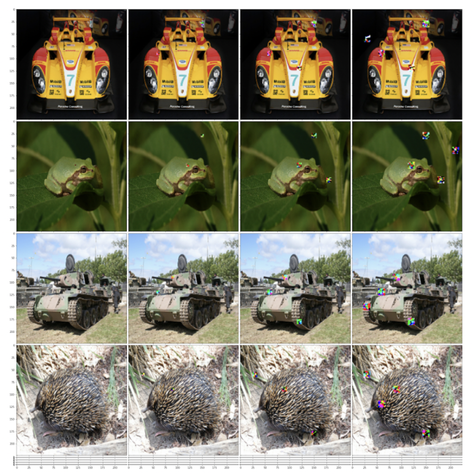
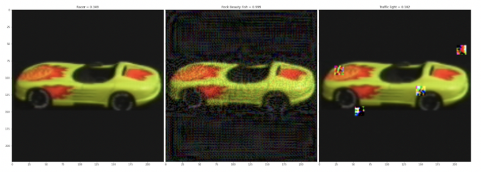

# DAR_adversarial

This folder contains three files: 

DAR_PGD_ImageNet - implements the DAR method on ImageNet data, based on Projected Gradient Descent (PGD) method
DAR_PGD_COIL - implements the DAR method on COIL data, based on Projected Gradient Descent (PGD) method
DAR_UAP - implements the DAR method on ImageNet data based on Universal Adversarial Perturbations (UAP) method

The methods currently retrieve the data from the user’s working directory, these filepaths must be updated.

The above image demonstrates the application of DARs on a selection of ImageNet images for DARs of different size and number

This image compares the confidence of MobileNetV2 for a clean image, versus PGD applied to the whole image, versus DARs
